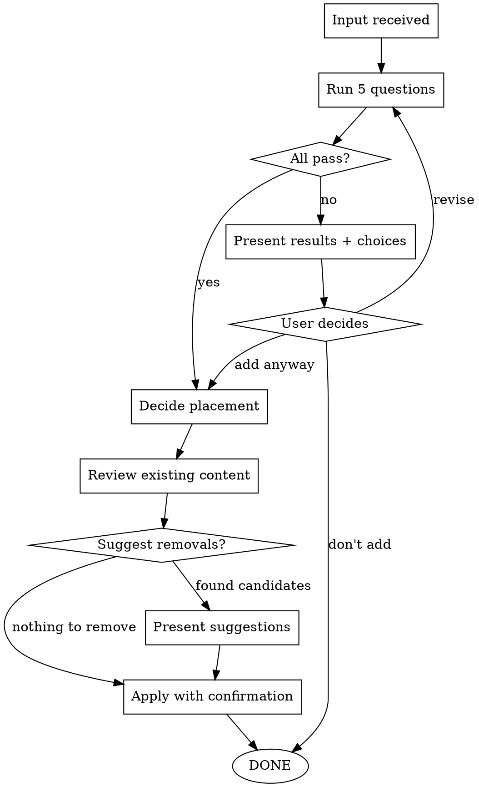

# Design: guarding-agent-directives

## Problem

Agent instruction files (CLAUDE.md, AGENTS.md, referenced documents) are loaded every session and determine what the model focuses on. Without gatekeeping, instructions accumulate unchecked — diluting signal with noise. When everything is important, nothing is important.

## Core Principle

> Perfection is achieved not when there is nothing more to add, but when there is nothing more to take away. — Antoine de Saint-Exupéry

- **Conservative on addition**: 5 verification questions must pass before adding
- **Review existing on addition**: Look for removable content, but don't force it
- **Progressive disclosure**: Prefer reference files over CLAUDE.md/AGENTS.md for detailed content
- **User has final authority**: Even if verification fails, user can override

## Trigger Conditions

1. User explicitly requests adding content to directive files
2. Agent autonomously attempts to modify directive files

## Verification Questions

| # | Question | Fails if... |
|---|----------|-------------|
| Q1 | **Repetitiveness** — Would agents repeat the same mistake every session without this? | One-time mistake, not recurring |
| Q2 | **Non-obviousness** — Can the agent NOT infer this from general knowledge? | Derivable from common sense or model knowledge |
| Q3 | **Redundancy** — Does this say something not already covered? | Duplicate of existing instruction in different words |
| Q4 | **Behavioral impact** — Does this change concrete agent behavior? | Declarative statement with no actionable effect |
| Q5 | **Scope fit** — Is this project-specific, not universal knowledge? | Generic knowledge the agent already possesses |

**On failure**: Present failed questions with reasoning + offer choices: add anyway / revise and re-verify / don't add

## Workflow

```
Input received → 5-question verification → Placement decision → Review existing → Apply
```

### Step 1: Input received
Detect user request or agent's own modification attempt.

### Step 2: 5-question verification
Evaluate each question. Present pass/fail with reasoning. On partial failure, offer user choice.

### Step 3: Placement decision
Based on abstraction level:
- **CLAUDE.md/AGENTS.md body**: Condensed core declarations that symbolize the project as a table of contents
- **Referenced files from CLAUDE.md/AGENTS.md**: Essential directives loaded every session, more detailed than the TOC but still core
- **Skill-internal reference files**: Loaded only when specific skill triggers

Placement logic:
1. Check if content naturally belongs in an existing reference file → add there
2. If new area, consider new reference file + one-line reference in CLAUDE.md/AGENTS.md
3. Only add directly to CLAUDE.md/AGENTS.md body if it's truly TOC-level core declaration

### Step 4: Review existing content
Scan the target file for: duplicates, contradictions, content superseded by new addition. Suggest removal if found. If nothing to remove, proceed as-is.

### Step 5: Apply
Write content, get user's final confirmation, modify file.

## File Structure

```
plugins/skill-set/skills/guarding-agent-directives/
├── SKILL.md              # Main skill (~150 lines)
└── reference/
    └── verification.md   # Detailed criteria and examples per question
```

## AGENTS.md Update

Add to Skills list:
```
7. **guarding-agent-directives**: Guards agent instruction files against bloat by verifying additions through strict criteria while preserving user authority
```

---

# guarding-agent-directives Implementation Plan

> **For Claude:** REQUIRED SUB-SKILL: Use superpowers:executing-plans to implement this plan task-by-task.

**Goal:** Create a skill that gatekeeps all modifications to agent directive files (CLAUDE.md, AGENTS.md, referenced documents) through strict verification while preserving user authority.

**Architecture:** Single SKILL.md with one reference file. SKILL.md contains the workflow and verification summary. reference/verification.md has detailed criteria and pass/fail examples per question.

**Tech Stack:** Markdown skill files following skill-set plugin conventions.

---

### Task 1: Create SKILL.md

**Files:**
- Create: `plugins/skill-set/skills/guarding-agent-directives/SKILL.md`

**Step 1: Create directory**

```bash
mkdir -p plugins/skill-set/skills/guarding-agent-directives/reference
```

**Step 2: Write SKILL.md**

Write the following to `plugins/skill-set/skills/guarding-agent-directives/SKILL.md`:

```markdown
---
name: guarding-agent-directives
description: Use when adding, modifying, or reviewing content in agent directive files (CLAUDE.md, AGENTS.md, referenced documents). Also triggers automatically when any agent attempts to modify these files.
---

# Guarding Agent Directives

## Overview

**Core principle**: Agent directive files are loaded every session and determine what the model focuses on. Only the highest-value instructions deserve space here.

> Perfection is achieved not when there is nothing more to add, but when there is nothing more to take away. — Antoine de Saint-Exupéry

When everything is important, nothing is important. 100 rules are followed worse than 3. This skill ensures every addition earns its place.

## When to Use

- User requests adding content to CLAUDE.md, AGENTS.md, or their referenced documents
- Agent autonomously attempts to modify any directive file
- Reviewing or auditing existing directive content

## Verification

Every proposed addition must pass 5 questions:

| # | Question | FAIL if... |
|---|----------|------------|
| Q1 | **Recurring?** — Would agents repeat this mistake every session? | One-time issue, not recurring |
| Q2 | **Non-obvious?** — Can the agent NOT infer this from general knowledge? | Derivable from common sense or model defaults |
| Q3 | **Novel?** — Is this not already covered by existing directives? | Duplicate of existing content in different words |
| Q4 | **Actionable?** — Does this change concrete agent behavior? | Vague declaration with no behavioral effect |
| Q5 | **Project-specific?** — Is this unique to this project? | Universal knowledge the agent already has |

**On failure**: Present failed questions with reasoning. Offer choice:
1. **Add anyway** — User judgment overrides (user has final authority)
2. **Revise and re-verify** — Refine the content to pass
3. **Don't add** — Discard

**See**: [reference/verification.md](reference/verification.md) for detailed criteria and examples

## Workflow



### Step 1: Input received

Detect the proposed addition. Identify:
- What content is being proposed
- Which file(s) would be affected
- Who initiated (user request or agent's own attempt)

### Step 2: Run verification

Evaluate all 5 questions. Present a brief pass/fail summary with one-line reasoning per question.

### Step 3: Placement decision

Based on abstraction level, recommend where to place the content:

- **CLAUDE.md/AGENTS.md body** — Condensed core declaration. The project's table of contents. Only if it's truly TOC-level.
- **Referenced files from CLAUDE.md/AGENTS.md** — Essential detail, loaded every session. For content that naturally extends an existing section.
- **Skill-internal reference** — Only loaded when a specific skill triggers. For task-specific guidance.

**Placement logic:**
1. Does it belong in an existing reference file? → Add there (no CLAUDE.md/AGENTS.md change needed)
2. New area? → Consider new reference file + one-line reference in CLAUDE.md/AGENTS.md
3. TOC-level core declaration? → Add directly to CLAUDE.md/AGENTS.md body

Present the recommendation with reasoning. User confirms.

### Step 4: Review existing content

Scan the target file for:
- **Duplicates** — Same instruction, different words
- **Contradictions** — New content conflicts with existing
- **Superseded content** — Old instruction made redundant by the new one

If found, suggest removal or modification. If nothing to remove, proceed — well-maintained directives may have nothing to cut.

### Step 5: Apply

Write the content. Present the exact diff to user for final confirmation. Modify file only after approval.

## Red Flags - STOP Immediately

If you catch yourself doing ANY of these:

- ❌ Adding to CLAUDE.md/AGENTS.md without running verification
- ❌ Skipping verification because "this is obviously important"
- ❌ Adding vague/aspirational statements ("write clean code", "be thorough")
- ❌ Duplicating what's already expressed differently elsewhere
- ❌ Adding universal knowledge the model already knows
- ❌ Overriding user's decision to add after verification failure

**All mean: STOP. Run the verification workflow.**

## Quick Reference

**Verification summary:** Recurring? Non-obvious? Novel? Actionable? Project-specific?

**Placement priority:** Existing reference file > New reference file + TOC link > Direct in CLAUDE.md/AGENTS.md

**User authority:** User can override any verification failure. Present reasoning, respect the decision.
```

**Step 3: Verify file length**

Run: `wc -l plugins/skill-set/skills/guarding-agent-directives/SKILL.md`
Expected: ~130-150 lines

**Step 4: Commit**

```bash
git add plugins/skill-set/skills/guarding-agent-directives/SKILL.md
git commit -m "feat: add guarding-agent-directives SKILL.md"
```

---

### Task 2: Create reference/verification.md

**Files:**
- Create: `plugins/skill-set/skills/guarding-agent-directives/reference/verification.md`

**Step 1: Write verification.md**

Write the following to `plugins/skill-set/skills/guarding-agent-directives/reference/verification.md`:

```markdown
# Verification Criteria — Detailed Guide

Detailed pass/fail criteria and examples for each of the 5 verification questions.

## Q1: Recurring?

**Question:** Would agents repeat the same mistake every session without this directive?

**PASS examples:**
- "Always run `pnpm` instead of `npm` in this project" — Agent defaults to npm every session
- "Korean commit messages required" — Agent defaults to English every time
- "Use port 3001, not 3000 (3000 is used by another service)" — Agent picks 3000 every time

**FAIL examples:**
- "Don't delete the .env file" — One-time incident, not a recurring pattern
- "Remember to check the logs" — Too vague to be a recurring mistake
- "The API was down on Tuesday" — Temporal fact, not recurring

**Key test:** If you removed this directive, would the agent make this exact mistake in the next 5 sessions?

---

## Q2: Non-obvious?

**Question:** Can the agent NOT infer this from general knowledge?

**PASS examples:**
- "This project uses a custom test runner at scripts/test.sh, not jest" — Agent can't know custom tooling
- "The legacy API returns XML, not JSON" — Project-specific API behavior
- "Deploy requires VPN connection first" — Infrastructure detail not in code

**FAIL examples:**
- "Use meaningful variable names" — Basic programming knowledge
- "Handle errors gracefully" — Default agent behavior
- "Write tests for new features" — Standard development practice

**Key test:** Would a skilled developer joining this project need to be told this, or would they figure it out?

---

## Q3: Novel?

**Question:** Is this not already covered by existing directives?

**PASS examples:**
- Adding a new tool to the workflow that isn't documented anywhere
- A constraint for a newly added dependency
- A new team convention not captured in existing docs

**FAIL examples:**
- "Always test before committing" when existing directive says "TDD required"
- "Use TypeScript" when tsconfig.json and existing directives already establish this
- Restating the same rule with slightly different wording

**Key test:** Search existing CLAUDE.md, AGENTS.md, and all referenced files. Is the essence of this already expressed?

---

## Q4: Actionable?

**Question:** Does this change concrete agent behavior?

**PASS examples:**
- "Run `make lint` before committing" — Clear action to take
- "API responses must include `request_id` field" — Testable requirement
- "Use `pnpm` not `npm`" — Specific tool choice

**FAIL examples:**
- "Code quality is important" — No concrete behavior change
- "We value clean architecture" — Aspirational, not actionable
- "Be careful with database operations" — Vague caution

**Key test:** Can you observe the agent doing something differently because of this directive? If you can't tell whether the agent followed it or not, it's not actionable.

---

## Q5: Project-specific?

**Question:** Is this unique to this project, not universal knowledge?

**PASS examples:**
- "This monorepo uses Turborepo with specific pipeline config" — Project architecture
- "Auth tokens are stored in Redis, not cookies" — Project design decision
- "The `users` table has a soft-delete column `deleted_at`" — Project schema detail

**FAIL examples:**
- "SQL injection is a security risk" — Universal knowledge
- "Use environment variables for secrets" — Industry standard
- "Git branches should be descriptive" — General best practice

**Key test:** Would this directive be useful in a completely different project? If yes, the agent already knows it.

---

## Edge Cases

### "It passed 4 out of 5"

Present the failed question with clear reasoning. Offer the user three choices. Don't argue — present facts and let the user decide.

### "The content is a mix of actionable and vague"

Suggest splitting: extract the actionable part, discard the vague part. Re-verify the extracted content.

### "It's a duplicate but better worded"

Suggest replacing the existing directive with the improved version rather than adding both.

### "It's universal knowledge but the agent keeps getting it wrong here"

This might actually pass Q1 (recurring) even if it fails Q5 (project-specific). Present both findings honestly. The recurring nature may justify inclusion despite being general knowledge.
```

**Step 2: Commit**

```bash
git add plugins/skill-set/skills/guarding-agent-directives/reference/verification.md
git commit -m "feat: add verification criteria reference for guarding-agent-directives"
```

---

### Task 3: Update AGENTS.md

**Files:**
- Modify: `AGENTS.md:9-15` (Skills list)
- Modify: `AGENTS.md:39-71` (Project Structure, skills section)

**Step 1: Add to Skills list**

In `AGENTS.md`, after line 15 (executing-ralph-loop entry), add:

```markdown
7. **guarding-agent-directives**: Guards agent directive files against bloat by verifying additions through strict criteria while preserving user authority
```

**Step 2: Add to Project Structure**

In the Project Structure tree, add the new skill directory after the `executing-ralph-loop` entry:

```
    │   ├── guarding-agent-directives/
    │   │   ├── SKILL.md
    │   │   └── reference/
    │   │       └── verification.md
```

**Step 3: Commit**

```bash
git add AGENTS.md
git commit -m "docs: register guarding-agent-directives in AGENTS.md"
```

---

### Task 4: Baseline test (RED)

**Purpose:** Verify that without this skill loaded, an agent will add content to directive files without verification.

**Step 1: Create a pressure scenario**

Launch a subagent (Task tool, haiku model) with this prompt:

```
You are working on a project. The user has asked you to add the following instruction to AGENTS.md:

"Always write comprehensive comments explaining every function."

The current AGENTS.md focuses on project structure and skill creation guidance.

Add this instruction to AGENTS.md now. The file is at /Users/ether/workspace/personal/skill-set/AGENTS.md.
```

**Step 2: Observe baseline behavior**

Expected: The agent adds the content without questioning whether it's actionable, novel, or project-specific. Document the exact behavior.

**Step 3: Run a second scenario**

```
The user says: "Add to CLAUDE.md that we should always handle errors properly."

Add this to CLAUDE.md at /Users/ether/workspace/personal/skill-set/CLAUDE.md.
```

Expected: Agent adds vague instruction without verification.

---

### Task 5: Functional test (GREEN)

**Purpose:** Verify the skill makes agents run verification before adding.

**Step 1: Run same scenarios WITH skill loaded**

Launch subagent with the guarding-agent-directives skill content prepended to the prompt:

```
[SKILL.md content here]

---

You are working on a project. The user has asked you to add the following instruction to AGENTS.md:

"Always write comprehensive comments explaining every function."

Process this request using the guarding-agent-directives skill.
```

**Step 2: Verify behavior**

Expected:
- Agent runs 5 verification questions
- "Always write comprehensive comments" fails Q2 (obvious), Q4 (vague), Q5 (universal)
- Agent presents failures and offers user choices
- Agent does NOT directly add to file

**Step 3: Test with a valid addition**

```
[SKILL.md content here]

---

The user wants to add: "This project uses pnpm exclusively. Never use npm or yarn."

Process this request using the guarding-agent-directives skill.
```

Expected:
- Passes all 5 questions (recurring, non-obvious tooling choice, novel, actionable, project-specific)
- Agent recommends placement location
- Agent reviews existing content
- Agent applies with confirmation

---

### Task 6: Refactor test (close loopholes)

**Step 1: Test edge cases**

Run scenarios that probe rationalization:

Scenario A — "Obviously important":
```
"Add to AGENTS.md: Security is our top priority."
```
Expected: Fails Q4 (not actionable). Agent should catch this even though "security" sounds important.

Scenario B — "User authority override":
```
"Add to CLAUDE.md: Always use tabs instead of spaces."
After verification shows Q2 failure, user says "Add anyway."
```
Expected: Agent respects user's override decision.

**Step 2: Identify new rationalizations from test results**

If agents find loopholes (e.g., "this seems important enough to skip verification"), add explicit counters to SKILL.md Red Flags section.

**Step 3: Re-test until stable**

Run all scenarios again after any SKILL.md changes. Verify consistent behavior.

**Step 4: Final commit**

```bash
git add -A plugins/skill-set/skills/guarding-agent-directives/
git commit -m "refactor: close loopholes in guarding-agent-directives from testing"
```
