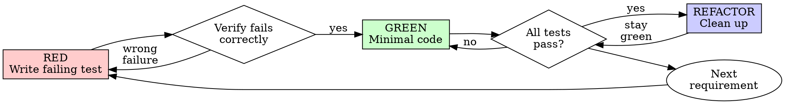

# Developing Test-First

## Overview

Write the test first. Watch it fail. Write minimal code to pass.

**Core principle:** If you didn't watch the test fail, you don't know if it tests the right thing.

This is a discipline skill — absolute rules, no exceptions. Violating the letter of the rules is violating the spirit of the rules.

## When to Use

**Always:**
- New features
- Bug fixes
- Behavior changes
- Refactoring

**Exceptions (ask your human partner):**
- Throwaway prototypes
- Generated code
- Configuration files

**Do NOT use for:**
- Test strategy and layer design → `driving-with-tests`
- Classifying CI failure output → `autofixing-and-escalating`
- Test framework API docs → `understanding-code-context`

Thinking "skip TDD just this once"? Stop. That's rationalization.

## The Iron Law

```
NO PRODUCTION CODE WITHOUT A FAILING TEST FIRST
```

Write code before the test? Delete it. Start over.

**No exceptions:**
- Don't keep it as "reference"
- Don't "adapt" it while writing tests
- Don't look at it
- Delete means delete

Implement fresh from tests. Period.

## Red-Green-Refactor



### RED — Write Failing Test

Write one minimal test showing what should happen.

**Requirements:**
- One behavior per test
- Clear name that describes expected behavior
- Real code, not mocks (unless external dependency is unavoidable)

### Verify RED — MANDATORY. Never skip.

Run the test. Confirm:
- Test **fails** (not errors — syntax errors and import failures don't count)
- Failure message matches expectations
- Fails because the feature is missing, not because of typos or setup

**Test passes?** You're testing existing behavior. Fix the test.
**Test errors?** Fix the error, re-run until it fails on the assertion.

### GREEN — Minimal Code

Write the simplest code to pass the test. Nothing more.

Don't add features, refactor other code, or "improve" beyond what the test demands.

### Verify GREEN — MANDATORY.

Run the test. Confirm:
- New test passes
- All other tests still pass
- Output is clean (no errors, no warnings)

**New test fails?** Fix code, not test.
**Other tests fail?** Fix the regression now.

### REFACTOR — Clean Up

After green only:
- Remove duplication
- Improve names
- Extract helpers

Keep all tests green. Don't add behavior during refactoring.

Then: next failing test for the next requirement.

## Why Order Matters

Tests written after code pass immediately — proving nothing. Tests-first force you to see the failure, proving the test actually catches the bug. Tests-after verify what you **remembered**. Tests-first discover what you **didn't**.

If you wrote code before the test: delete it. The sunk cost fallacy says "keep it." Reality says keeping unverified code is technical debt. See the rationalization table below for common excuses and their rebuttals.

## Common Rationalizations

See `reference/anti-patterns.md` for the full rationalization table with rebuttals.

## Red Flags — STOP and Start Over

- Wrote code before writing a test
- Test written after implementation
- Test passes immediately on first run
- Can't explain why the test failed
- Tests planned for "later" or "follow-up"
- Rationalizing "just this once"
- "I already manually tested it"
- "Tests after achieve the same purpose"
- "It's about spirit not ritual"
- "Keep as reference" or "adapt existing code"
- "Already spent X hours, deleting is wasteful"
- "TDD is dogmatic, I'm being pragmatic"
- "This is different because..."

**All of these mean: Delete code. Start over with TDD.**

## When Stuck

| Problem | Solution |
|---------|----------|
| Don't know how to test | Write the wished-for API. Write assertion first. Ask your human partner. |
| Test too complicated | Design too complicated. Simplify the interface. |
| Must mock everything | Code too coupled. Use dependency injection. See `reference/anti-patterns.md`. |
| Test setup is huge | Extract test helpers. Still complex? Simplify the design. |
| Flaky test | Find root cause — timing, shared state, ordering. Never skip or retry. |

## Verification Checklist

See `reference/anti-patterns.md` for the full checklist. Summary: every function has a test, each test was watched failing, minimal code was written to pass, all tests pass cleanly.

## Troubleshooting

| Problem | Fix |
|---------|-----|
| Test fails with error, not assertion failure | Fix syntax/import errors first. RED means assertion failure, not crash. |
| Test passes immediately on first run | You're testing existing behavior. Rewrite the test to target the missing feature. |
| Flaky test (passes sometimes, fails sometimes) | Find root cause: timing, shared state, test ordering. Never skip or retry. |
| Must mock everything to test a function | Code is too coupled. Refactor with dependency injection. See `reference/anti-patterns.md`. |
| Test setup is longer than test logic | Extract test helpers. If still complex, simplify the design under test. |
| Unsure what to test first | Write the wished-for API. Start with the assertion, work backward. |
| Existing codebase has no tests | Add tests for the code you are changing. Do not boil the ocean. |

## Language Detection

Detect your human partner's language from conversation context, project docs, and git history. Default to English. Adapt all user-facing messages; keep code, test names, and commands in English.

## Composability

- **Standalone**: Use for any coding task — no other skill required
- **With `driving-with-tests`**: Pair for full test strategy (Orient → TDD → Probe → Guard)
- **Within `ralph` iterations**: Apply TDD discipline inside each iteration

## Reference

- `reference/anti-patterns.md` — Mocking pitfalls, test-only methods, Gate Functions
