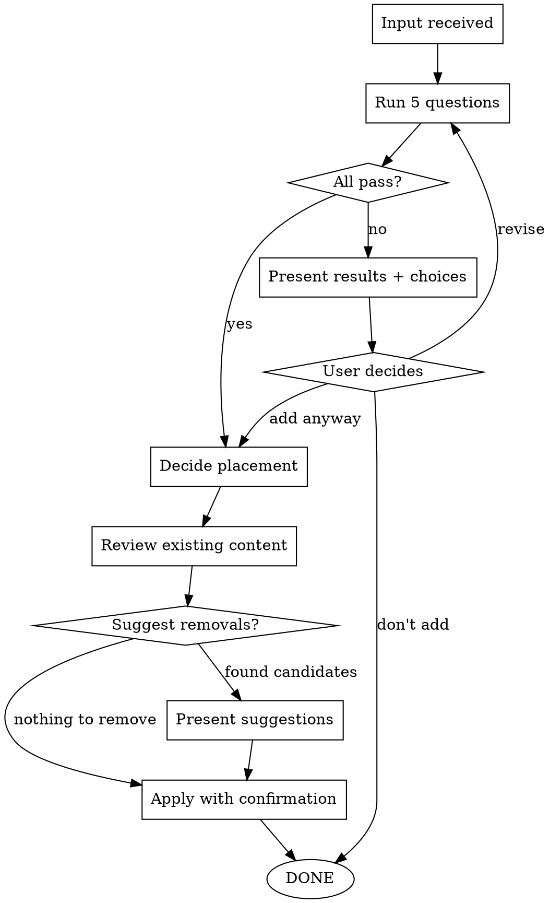

# Guarding Agent Directives

## Overview

**Core principle**: Agent directive files are loaded every session and determine what the model focuses on. Only the highest-value instructions deserve space here.

> Perfection is achieved not when there is nothing more to add, but when there is nothing more to take away. — Antoine de Saint-Exupéry

When everything is important, nothing is important. 100 rules are followed worse than 3. This skill ensures every addition earns its place.

## When to Use

- User requests adding content to CLAUDE.md, AGENTS.md, or their referenced documents
- Agent autonomously attempts to modify any directive file
- Reviewing or auditing existing directive content

## Verification

Every proposed addition must pass 5 questions:

| # | Question | FAIL if... |
|---|----------|------------|
| Q1 | **Recurring?** — Would agents repeat this mistake every session? | One-time issue, not recurring |
| Q2 | **Non-obvious?** — Can the agent NOT infer this from general knowledge? | Derivable from common sense or model defaults |
| Q3 | **Novel?** — Is this not already covered by existing directives? | Duplicate of existing content in different words |
| Q4 | **Actionable?** — Does this change concrete agent behavior? | Vague declaration with no behavioral effect |
| Q5 | **Project-specific?** — Is this unique to this project? | Universal knowledge the agent already has |

**On failure**: Present failed questions with reasoning. Offer choice:
1. **Add anyway** — User judgment overrides (user has final authority)
2. **Revise and re-verify** — Refine the content to pass
3. **Don't add** — Discard

**See**: [reference/verification.md](reference/verification.md) for detailed criteria and examples

## Workflow

### Step 1: Input received

Detect the proposed addition. Identify:
- What content is being proposed
- Which file(s) would be affected
- Who initiated (user request or agent's own attempt)

### Step 2: Run verification

Evaluate all 5 questions. Present a brief pass/fail summary with one-line reasoning per question.

### Step 3: Placement decision

Based on abstraction level, recommend where to place the content:

- **CLAUDE.md/AGENTS.md body** — Condensed core declaration. The project's table of contents. Only if it's truly TOC-level.
- **Referenced files from CLAUDE.md/AGENTS.md** — Essential detail, loaded every session. For content that naturally extends an existing section.
- **Skill-internal reference** — Only loaded when a specific skill triggers. For task-specific guidance.

**Placement logic:**
1. Does it belong in an existing reference file? → Add there
2. New area? → Consider new reference file + one-line reference in CLAUDE.md/AGENTS.md
3. TOC-level core declaration? → Add directly to CLAUDE.md/AGENTS.md body

Present the recommendation with reasoning. User confirms.

### Step 4: Review existing content

Scan the target file for:
- **Duplicates** — Same instruction, different words
- **Contradictions** — New content conflicts with existing
- **Superseded content** — Old instruction made redundant by the new one

If found, suggest removal or modification. If nothing to remove, proceed — well-maintained directives may have nothing to cut.

### Step 5: Apply

Write the content. Present the exact diff to user for final confirmation. Modify file only after approval.

## Red Flags - STOP Immediately

If you catch yourself doing ANY of these:

- Adding to directive files without running verification
- Skipping verification because "this is obviously important"
- Adding vague/aspirational statements ("write clean code", "be thorough")
- Duplicating what's already expressed differently elsewhere
- Adding universal knowledge the model already knows
- Overriding user's decision to add after verification failure

**All mean: STOP. Run the verification workflow.**

## Quick Reference

**Verification summary:** Recurring? Non-obvious? Novel? Actionable? Project-specific?

**Placement priority:** Existing reference file > New reference file + TOC link > Direct in CLAUDE.md/AGENTS.md

**User authority:** User can override any verification failure. Present reasoning, respect the decision.
